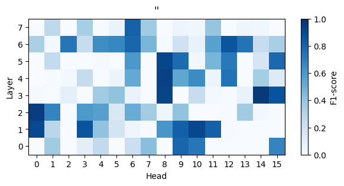
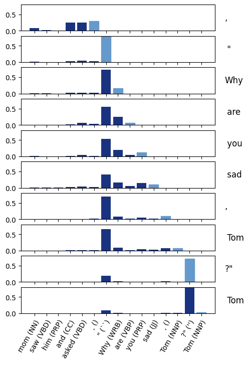

# Finding Linguistic Induction Heads in TinyStories

This is a project I (Markus Sibbesen) did as part of an "Advanced Natural Language Processing and Deep Learning" course together with my colleages Martin Kirkegaard, Florian Micliuc and Phillip Winstrøm-Jespersen. 

The code was hosted in the university's internal github, so I've copied it here.

---

## Summary of Findings


We investigate the attention mechanism in a small transformer-based language model, TinyStories-1M. This model is trained exclusively on short, simple texts, and has remarkable abilities to produce grammatically correct text, despite its small size. 

We train classification probes that predict Part-Of-Speech tag (POS-tag) on key and query vectors of all attention heads in the model and find that their performance varies considerably across heads. Based on these results, we focus our investigations into heads, for which the corresponding probe's performance is particularly good, to figure out when the head is active and what it attends to. We identify: 
1. A quotation head, which is active inside a quotation and attends to quotation-marks.
2. A past tense verb predictor head, which is active on tokens immediately preceding a past tense verb, and attends back to previous past tense verbs.
3. A definite noun predictor head, which is active on possessive pronouns and definite articles and attends back to preceding nouns.

We interpret case 2 and 3 as examples of *Induction Heads*.


### Methods

#### Classification Probes

For each layer and head of TinyStories-1M, we train a multinomial logistic regression probe 
```math
p_k(\mathbf{x}) = \mathrm{softmax}_k(W\mathbf{x} + \mathbf{b})
```
on key and query vectors $`\mathbf{x} \in \mathbb{R}^{d_k}`$, for $K$ different POS-tags. To fit the weight matrix $W \in \mathbb{R}^{K\times {d_k}}$ and bias term $\mathbf{b} \in \mathbb{R}^K$, we minimize the expected *cross-entropy loss*:
```math
\mathcal{L} =- \sum_{k=1}^K[y_i=k]\log(p_k(\mathbf{x_i}))
```
for a given activation $\mathbf{x}_i$ with label $y_i\in\{1, \dots, K\}$ (converted from POS-tag to an integer).


#### Measuring the Contribution to the Residual Stream (*activity*)

For $`\mathrm{head}_i`$, we compute its contribution ($c_{i} \in \mathbb{R}^{d_{model}}$) to the Multi-Head Attention (MHA) output for each token in a sequence:

```math
c_{i} = \mathrm{head}_{i} W^O_{[start_i\,:\,end_i,\;\::\;\:]}
```

with $start_i, end_i$ being the start and end indices of $`\mathrm{head}_i`$ in the concatenated MHA. $c_{i}$ is then the component of a multi-head attention block's output, which head $i$ is responsible for. $W^O \in \mathbb{R}^{h \cdot d_k \times d_{\text{model}}}$ is the weight matrix that filter the MHA into the residual stream. For TinyStories-1M which has $h = 16$ heads, each with size $d_k=4$,  $d_{model}= h \cdot d_k = 64$.


We then use the euclidean norm $\|c_{i}\|_2$ to measure the magnitude of $`\mathrm{head}_i`$'s contribution. We refer to this magnitude as the head's *activity*.


### Case study 1: Quotation head


*Probe accuracy results for beginning of quote*



*Probe accuracy results for end of quote*

We assess the performance of the key-probes on the POS-tags `` (beginning of quote) and '' (end of quote) and find that L2H0 performs well on both. This suggests that it attends highly to both the beginning of quotation and the end of a quotations.


*Activity of L2H0 on an example sentence*

When observing the activity of L2H0, we find that its contribution to the residual stream is high while inside a quotation, but drops off sharply afterwards.



*Attention pattern of L2H0 on an example sentence*

We inspect the attention pattern of L2H0  and find that while inside a quotation, it attends highly to the start-quotation mark, until the end, when it shifts to the end-quotation mark.

### Case Study 2: Past Tense Verb Induction Head


*Probe accuracy results for past tense verb*

We inspect the key-probes and find that the performance in classifying the tag VBD (verbs in past tense) is high when trained on the early layers, but drops off gradually through the model. There is, however, one notable exception: L6H4 exhibits a high F1-score, so we investigate it.


*Activity of L6H4 on an example sentence*


*Attention pattern of L6H4 on an example sentence*

We find that the activity of L6H4 is high immediately before a verb in past tense. At those points, it attends back to previous verbs.

### Case Study 3: Definite Noun Induction Head


*Probe results for possesive pronouns*

We inspect the query-probes that do well in classifying the tag PRP\$ (possessive pronouns) and after further qualitative investigations, we find that one of them, L5H5, exhibits an interesting pattern. 


*Activity of L5H5 on an example sentence*

We see that the attention head is particularly active on possessive pronouns (as expected) and the definite article, always right before a noun. 


*Attention pattern of L5H5 on an example sentence*

On these tokens, the head attends to the most recent other nouns

---
## Prerequisites

- **Python v3.12.2** or higher is required.
- Install the dependencies listed in `requirements.txt` by running the following command:

  ```zsh
  pip install -r requirements.txt
  ```
---

## Repository Structure

The repository is organized into the following directories:

### 1. `data`
This folder contains the data used to train our probes.

### 2. `figures`
The `figures` folder is divided into several subdirectories, each containing different types of visualizations:

- **2.1. `case-studies`**  
  Here, you’ll find all the figures related to our case studies.

- **2.2. `probes`**  
  This subdirectory holds the probe matrices figure.

- **2.3. `to_residual_stream`**  
  This folder showcases visualizations related to the information sent to the residual stream for certain tokens.

### 3. `main`
In this directory, you will find the main notebooks that were used to generate our results. These notebooks serve as the core of our analysis.

### 4. `old`
This folder contains older versions of notebooks, including various experiments and initial ideas. Some of these may no longer work as intended but can still provide useful insights into the development process.

### 5. `probe-results`
This folder contains the results of all the probe training, including both key and query training. We also experimented with concatenating different verb POS tags (VBD, VBP, VB) into a single "VB" tag, but ultimately chose not to use these.

---
